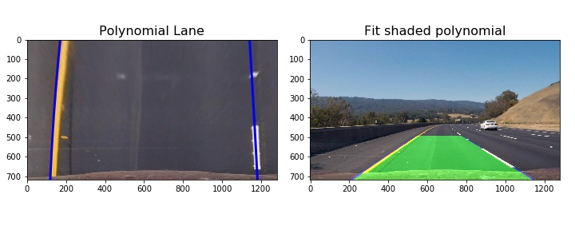

# Advanced Lane Finding

The goal in this project is to fine lane line on the road that is durable enough to adapt in environment changes.

---

## Software
Minimum software requirement:

* Jupyter Notebook
* Python
* OpenCV

## Pipeline

The steps of this project are the following:

* Compute the camera calibration matrix and distortion coefficients given a set of chessboard images.
* Apply a distortion correction to raw images.
* Apply a perspective transform to ("birds-eye view").
* Use color transforms to create a thresholded binary image.
* Detect image lane pixels with histogram and calculate fit line boundary.
* Determine the curvature of the lane and vehicle position.
* Transform a warp image with lane boundaries combination back onto the original image.
* Output visual display of the lane boundaries and numerical estimation of lane curvature and vehicle position.

The standard calibration images are stored in `camera_cal` folder.  The images in `test_images` are for testing your pipeline on single frames. The processed images and videos are stored in the folder called `output_images` and `output_videos`.

## Compute the camera calibration and apply a distortion to images
Camera calibration is a crucial step required to corrected camera distortion and coefficients. We are using chessboard OpenCV functions findChessboardCorners and calibrateCamera in this step. A number of test images stored in `camera_cal` folder are used and fed to the functions. Chessboard images yield an accurate and robust way to calculate camera coefficients by finding and compare corner of chessboard images. To increase corner detection accuracy I adopted method mention in this [Open CV tutorial](http://opencv-python-tutroals.readthedocs.io/en/latest/py_tutorials/py_calib3d/). The output of chessboard is objpoints and imgpoints. This objects then feed to calibrateCamera function to corrected a distortion of test images stored on `test_images` folder.

### Finding Corner of Chessboard Images Sample

### Undistort Test Images Sample

## Apply a perspective transform to birds-eye view
A perspective transform to and from "bird's eye" perspective is done in a function called birdeyeview(), The function takes as input an undistort color image, as well as the to bird boolean parameters. The are of transformation from source images coordinates is called 'sourceimg' and detination image is called 'destimg'.

The parameters are set as follows :

sourceimg = [[520, 495],[800, 495],[153, 720],[1200, 720]]
destimg = [[40, 0], [1250, 0],[40, 720], [1250, 720]]

### Birdeyeview Images Sample

## Apply a thresholds on combine binary images

In this step I explored several combinations of sobel thresholds and color channel thresholds in multiple color spaces. I chose to use B and L color space since yield a best combination in lane detection in my opinion. Below is an example of the combination of sobel magnitude and binary thresholds images:

### Histogram of lane detection
Histogram of lane detection help us to find lane line. An illustration of histogram below shown a peak where lane line can be found on original image.

## Projecting lane pixels, warp image and lane boundaries back onto the original image.

Detect a lane pixels is a step to locate a position of left and right line. With a help from histogram data I calculate the maximum peak as a line location. The two most prominent peaks in this histogram data will be good indicators of the x-position of the lane lines. The 'sliding windows search' function is to find peak, calculate and locate line location. Projected lines curve also calculate on next steps. Curvature detection can be found on curvature() function. The whole operation of detecting line lane is combine on
detecting_lane() function. This function combine all calculation we compute before hand including adjusted vehicle position and use it to detect a line. The final process also transform back vehicle position to original coordinate with help of
openCV function cv2.getPerspectiveTransform(). The transformation process can be found on vehicle_position() function.

##  Output visual display of the lane boundaries and numerical estimation of lane curvature and vehicle position.

Below is a sample image of lane detection.

##  Apply pipeline on test video.

Method mention above is test with video stream. Video result can be found on `output_videos` directory.
The pipeline work well on [project video](output_videos/result.mp4) and [challenge video](output_videos/challenge.mp4) (optional).

The pipeline doesn't work as expected on [harder challenge video](output_videos/harder_challenge.mp4) (optional).

##  Discussion

The robustness of line detection pipeline against environmental change (e.g shadows) found to be challenging specifically on harder_challenge video where vehicle run through sharp curves combine with rapidly changes light condition.

Improvement may be implement by taking a smaller section of image to accommodate sharper turn and shorter frame to process due to the quick change on frame. 
